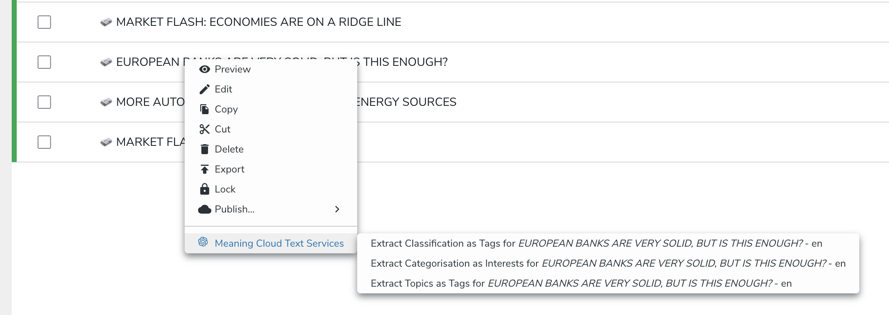
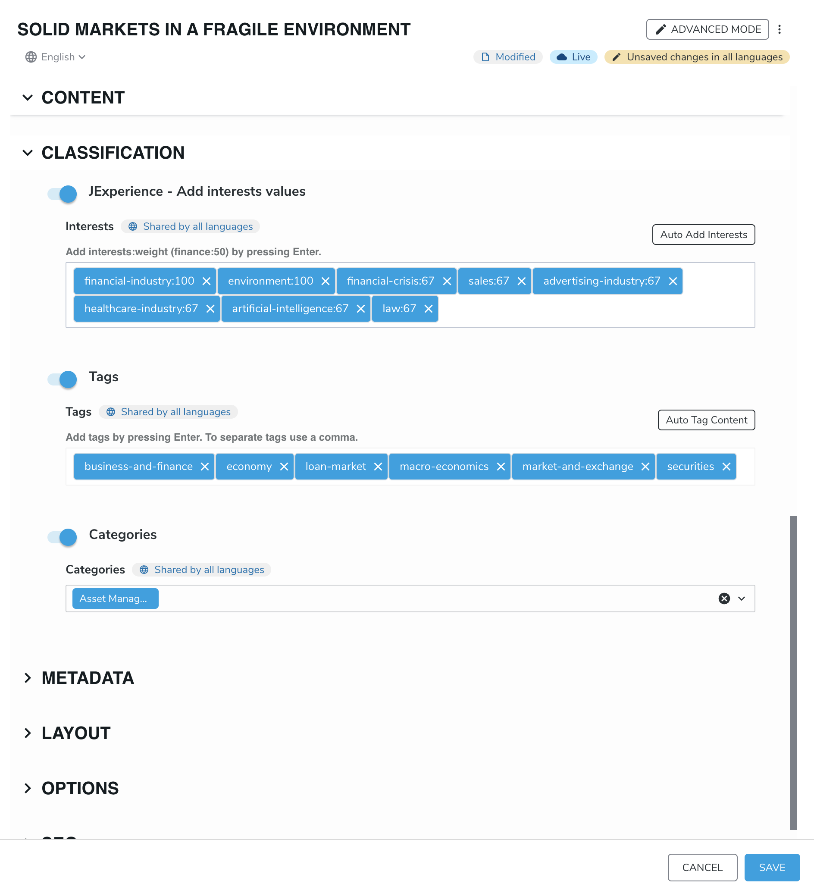

# Meaning Cloud Services

The aim of this module is to leverage Meaning Cloud Text Analysis Services for the following purposes:
- Automate the creation of page and content tags using Topics Extraction API version 2.0 (https://learn.meaningcloud.com/developer/topics-extraction/2.0/doc)
- Automate the creation of jExperience interests with their corresponding relevance as weight using Deep Categorization API version 1.0 (https://learn.meaningcloud.com/developer/deep-categorization/1.0/doc)
- Automate the creation of page and content tags using Text Classification API version 2.0 (https://learn.meaningcloud.com/developer/text-classification/2.0/doc)

## Installation
- In Jahia, go to "Administration --> Server settings --> System components --> Modules"
- Upload the JAR **meaningCloudServices-X.X.X.jar**
- Check that the module is started
- Activate it on the websites where you want to use it

## API KEY
You will need to request an API key from their website (https://www.meaningcloud.com/developer/apis) and update the org.jahia.se.modules.meaningCloudServices.cfg configuration file

meaningCloud.apikey=YOUR_API_KEY
 
meaningCloud.classificationModel=IAB_2.0-tier4 (you can select a different model from the ones available : https://learn.meaningcloud.com/developer/deep-categorization/1.0/models)

meaningCloud.namingConvention=IPTC_en (you can select a different model from the ones available : https://learn.meaningcloud.com/developer/text-classification/2.0/models)

## How to use
### From the mouse right click menu on a content item
- Right-click on a content of type jnt:page or jnt:content.
- The Meaning Cloud Text Services menu should appear at the bottom, containing the following sub-items:
	- Requesting Auto Tagging with Topic Extraction
    - Requesting Auto Tagging with Text Classification
	- Requesting to Add Interests with Deep Categorisation
-> The requested action is done at server side, and saved automatically for the selected content.

### From the content editor
- jExperience Interests has been relocated to the Classification Section
- Buttons have been added to jExperience Interests and Tags to auto generate them based on MeaningCloud text analysis Services
- By clicking, the service will returl the corresponding tags or interests, you'll have then the ability to alter, add or delete what's proposed. A final save action will validate all entries.

